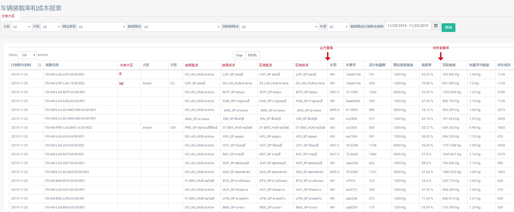
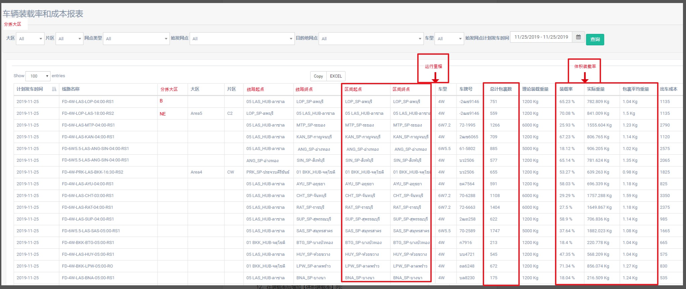

# 【BI】车辆装载率和成本报表2.0
## 需求
  

1，装载率、每公斤成本、每件包裹成本加排序按钮  
2，筛选和字段中的【大区】改名为【始发网点大区】，片区改名为【始发网点片区】  
3，增加【始发分拣大区】筛选，表格增加【始发分拣大区】列，放在【始发网点大区】前（取网点表里的sorting no）  
4，【计划发车时间】更名为【计划发车日期】  
5，增加字段解释（鼠标悬停字段名上时，浮窗展示）  
- 计划发车日期：线路始发站的计划发车日期  
- 总计包裹数：该车线上关联过的所有包裹的数量。  
- 理论装在重量：车辆的理论载重
- 装载率：(实际重量/理论装在重量)×100%
- 实际重量：该车线上关联过的所有包裹的重量
- 包裹平均重量：实际重量/总计包裹数
- 出车成本：车线价格
- 每件包裹成本：出车成本/总计包裹数
- 每公斤成本：实际重量/总计包裹数   

6，表格中大区片区为空时显示小横杠 -  
7，表格增加列【出车凭证号】，放在车型列前面  
8，【始发网点】列名变更为【线路起点】，【目的地网点】列名变更为【线路终点】  
9，车线按照区间分段，同一车线的区间按照到达顺序，从上到下排列在一起展示  
10，同一线路的不同区间下面8列，是按照不同的区间取得相应信息，其他列是相同的线路信息 

 

## 翻译
|中文|英文|泰文|
|--|--|--|
|总计包裹数：该车线上关联过的所有包裹的数量。|Total Parcels: The number of all parcels associated with the line.|是
|理论装载重量：车辆的理论载重|Theoretical load: the theoretical load of the vehicle	
|装载率：(实际重量/理论装在重量)*100%|Loading rate: (actual weight /   theoretical weight) * 100%	
|实际重量：该车线上关联过的所有包裹的重量。|Actual weight: The weight of all packages associated with the line.	
|包裹平均重量：实际重量/总计包裹数|Average package weight: actual weight /   total number of packages	
|出车成本：车线价格|Cost of departure: line price	
|每件包裹成本：出车成本/总计包裹数|Cost per package: cost of departure /   total number of packages	
|每公斤成本：实际重量/总计包裹数|Cost per kg: actual weight / total number   of packages	
|始发网点大区|Area of origin	
|始发网点片区|Originating dot area	
|始发分拣大区|Originating Sorting Area	
|线路起点|Starting point	
|线路终点|Destination of line	
|区间起点|Interval start	
|区间终点|End of interval	
|体积装载率|Volume loading rate	
|计划发车日期|Planned departure date	
|计划发车日期：线路始发站的计划发车日期|Planned departure date: Planned departure date of the line departure station	

.
